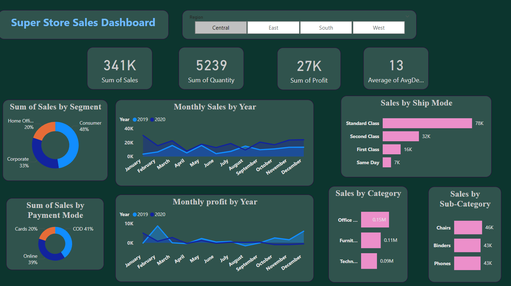
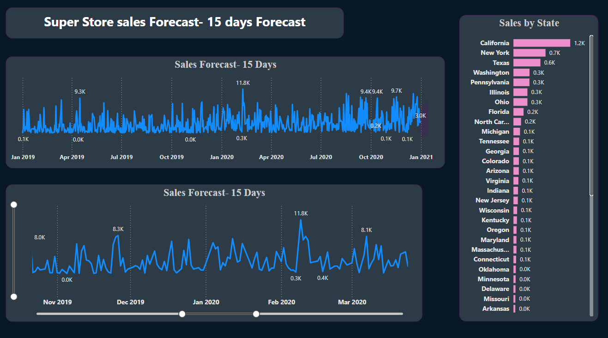

Super Store Sales Dashboard

📊 Overview
This Power BI dashboard offers a comprehensive analysis of Super Store sales, enabling businesses to track key metrics like revenue, profit, and customer trends across various segments. The dashboard is interactive and provides insightful visualizations for effective decision-making.

📷 Screenshots

🛠 Features
- Custom Visuals: Includes bar charts, line charts, and pie charts to track sales and profit.
- Data Cleaning & Transformation: Power Query Editor for data preprocessing and cleansing.
- Data Model Optimization: Efficient relationships and calculated measures for improved performance.
- Paginated Reports: Printable reports for detailed analysis.
- Decision Support System: Provides key performance indicators (KPIs) to guide business strategy.
  
 📌 Key Components

    ◼ KPIs & Metrics
- Total Sales: 341K
- Total Quantity Sold: 5,239
- Total Profit: 27K
- Average Days to Ship: 13

    ◼  Visuals Used:
  
- Sales by Segment (Consumer, Corporate, Home Office)
- Monthly Sales & Profit by Year (Comparing 2019 vs. 2020 trends)
- Sales by Ship Mode (Standard, Second, First Class, Same Day)
- Sales by Payment Mode (COD, Cards, Online)
- Sales by Category & Sub-Category (Office Supplies, Furniture, Technology, Chairs, Phones, Binders)
- Sales Forecasting (15 Days): A line chart forecasting sales for the next 15 days.
- Sales by State: A clustered bar chart showing sales across different states.
- Interactive Elements:
- Region Filters: (Central, East, South, West)

🚀 Installation & Usage
- Download the .pbix file from this repository.
- Open it in Power BI Desktop.
- Refresh the data sources if necessary.
- Explore the interactive visuals and filters.

🏆 Skills Demonstrated
- Data Analysis & Visualization
- Power Query & Data Cleaning
- DAX (Data Analysis Expressions)
- Forecasting & Trend Analysis
- Dashboard Development & KPI Monitoring
Business Intelligence Reporting
